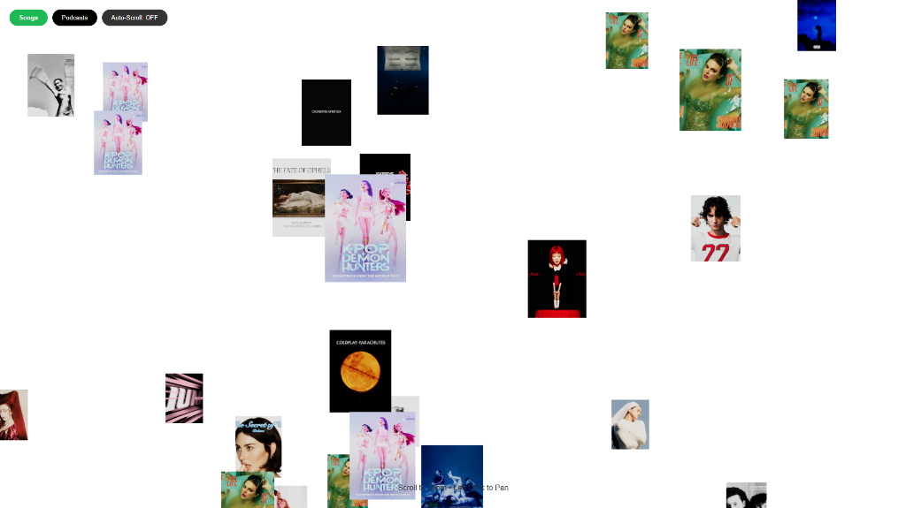

# Spotify WebGL Infinite Canvas

An interactive, infinite canvas experiment using React, TypeScript, and WebGL (via React Three Fiber) to visualize Spotify playlists in a spatial interface.



## Features

- **Infinite Spatial Canvas**: Drag to pan across an infinite 2D plane.
- **WebGL Rendering**: High-performance image rendering using WebGL.
- **Spotify Integration**: Connects to Spotify to fetch songs and podcasts.
- **Interactive Media**: Click to play tracks directly from the canvas.
- **Zoom & Navigation**: Smooth zoom controls and auto-panning capabilities.

## Tech Stack

- **Framework**: React + Vite
- **Language**: TypeScript
- **State Management**: Zustand
- **3D/Graphics**: React Three Fiber (@react-three/fiber), Drei
- **Styling**: TailwindCSS

## Getting Started

1.  **Clone the repository**
2.  **Install dependencies**:
    ```bash
    npm install
    ```
3.  **Setup Environment**:
    Create a `.env` file with your Spotify Client ID (see `.env.example` if available, or code).
4.  **Run Development Server**:
    ```bash
    npm run dev
    ```

## Controls

- **Left Click + Drag**: Pan the canvas
- **Scroll**: Zoom in/out
- **Click Item**: Play preview / Open media
